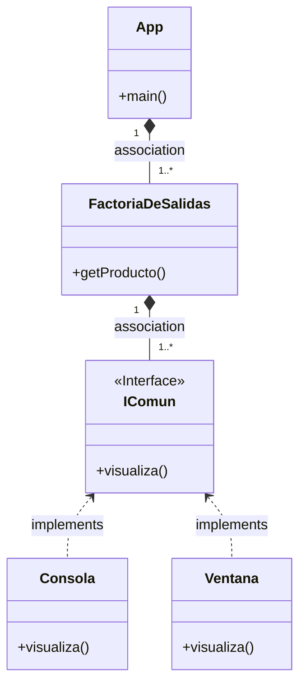

# Patrón Factory

Uso de Factoria muy sencillo

Diagrama de clases:

### Cambios

Añadele otra clase, por ejemplo `Impresora` y que imprima por consola el mensaje

Cambia la estructura de la Interfaz añadiendole el parámetro `msg` al método `visualiza()`